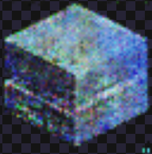

<h1 align="center">
  <br>
  Iceoh
</h1>

> A small, simple, 0 dependency JS library for isometric and 2d tilemaps


## Features

- Small, flexible, and fast
- Modern and fully typed
- Supports stacking tiles at different sizes and depths
- Unopinionated. Built with `pixi.js` in mind, should will work anywhere.
- Good enough

## Installation

```sh
npm install --save iceoh
```

## Quick Start

- [Documentation](https://iceoh.netlify.app)
- [Examples](https://iceoh.netlify.app/example.html)

For some quick and dirty examples that use `pixi.js`, see the [examples' source](./example/samples)

The following example is a naive vanilla example with canvas, to illustrate core concepts.
```js
import { Tilemap, IsoTilemap, TOP_LEFT, MIDDLE, CLASSIC, getDirection, DIRECTION, getDistance } from 'iceoh'

// This can be anything, PIXI.Sprite, Phaser.Sprite, whatever your tile object is.
class Sprite {
  width: number
  height: number
  image: CanvasImageSource
}

const canvas = document.getElementById('canvas')
const ctx = canvas.getContext('2d')

// 2d Tilemap
const map = new Tilemap<Sprite>({
  getScreenDimensions: () => canvas.getBoundingClientRect(),
  getWorldPosition: () => ({ x: 0, y: 0 }),
  getWorldScale: () => ({ x: 1, y: 1 }),
  worldOrigin: TOP_LEFT,
  baseOrigin: MIDDLE,
  baseTileDimensions: {
    width: 64,
    height: 64
  }
})

const map = new IsoTilemap<Sprite>({
  getScreenDimensions: () => canvas.getBoundingClientRect(),
  getWorldPosition: () => ({ x: 0, y: 0 }),
  getWorldScale: () => ({ x: 1, y: 1 }),
  worldOrigin: MIDDLE,
  baseOrigin: MIDDLE,
  projectionAngle: CLASSIC,
  baseTileDimensions: {
    width: 64,
    height: 64,
    depth: 32 // how many pixels tall is the front edge of the tile
  }
})

let sprite = new Sprite()

// takes grid coordinates and returns screen space coordinates to draw your sprite at
// the returned z coordinate is helpful if you're using a library with depth sorting
let { x, y, z } = map.add(sprite, { x: 0, y: 0, z: 0 })
ctx.drawImage(sprite.image, x, y, sprite.width, sprite.height)

// Move existing sprite to a new spot in the map, then draw the sprite in the new location
ctx.clearRect(x, y, sprite.width, sprite.height)
{ x, y, z } = map.move({ x: 0, y: 0, z: 0 }, { x: 1, y: 1, z: 0 })
ctx.drawImage(sprite.image, x, y, sprite.width, sprite.height)

// Get a sprite at map coordinates
map.get({ x: 1, y: 1, z: 0 }) === sprite // true

// Remove the tile at map coordinates and return it
map.remove({ x: 1, y: 1, z: 0 }) === sprite // true

// Get an array of all tiles at a given x,y
map.add(z0Sprite, { x: 2, y: 2, z: 0 })
map.add(z1Sprite, { x: 2, y: 2, z: 1 })
map.add(z2Sprite, { x: 2, y: 2, z: 2 })
const [z0Sprite, z1Sprite, z2Sprite] = map.getColumn<Sprite>({ x: 2, y: 2 })

// Get map coordinate from a screen point
{ x, y } = map.toTile({ x: mouse.x, y: mouse.y })
// and get world coordinates for an arbitrary map position
{ x: worldX, y: worldX } = map.toPoint({ x, y })

// Get a world position with a given map position at its center
{ x: worldX, y: worldX } = map.centerToTile({ x, y })

// Get the map dimensions, x/y being center tile coordinates
// width being max X, and height being max Y tile values
const { x, y, width, height, depth } = map.getBounds()

// Center viewport to center of map
{ x: worldX, y: worldX } = map.center()
// is the same as
{ x: worldX, y: worldX } = map.centerToTile(map.getBounds())

// Get the facing direction between two points
getDirection({ x: 1, y: 1 }, {x: 1, y: 0 }) === DIRECTION.N
getDirection({ x: 1, y: 1 }, {x: 2, y: 0 }) === DIRECTION.NE
getDirection({ x: 1, y: 1 }, {x: 2, y: 1 }) === DIRECTION.E
getDirection({ x: 1, y: 1 }, {x: 2, y: 2 }) === DIRECTION.SE
getDirection({ x: 1, y: 1 }, {x: 1, y: 2 }) === DIRECTION.S
getDirection({ x: 1, y: 1 }, {x: 0, y: 2 }) === DIRECTION.SW
getDirection({ x: 1, y: 1 }, {x: 0, y: 1 }) === DIRECTION.W
getDirection({ x: 1, y: 1 }, {x: 0, y: 0 }) === DIRECTION.NW

// get the distance between two points
const num = getDistance({ x: 1, y: 1 }, { x: 5, y: 5}) // num = ~5

```

## Prior Art

This library could not exist without the following libraries, which were not quite in the Goldilocks zone of what I wanted. If `Iceoh` sucks, try one of these!

- [JSIso](https://jsiso.com/)
- [Traviso](https://github.com/axaq/traviso.js)
- [Phaser Isometric Plugin](http://rotates.org/phaser/iso/)

## Contributing

When contributing to this repository, please first discuss the change you wish to make via issue, email, or any other method with the owners of this repository before making a change.

Contributions are welcome.

## Developing

```sh
git clone https://github.com/sammccord/iceoh.git
cd iceoh

# deps
pnpm install

# build
turbo run build

# To develop via examples
cd packages/example && npm run dev
open http://localhost:5173
```
